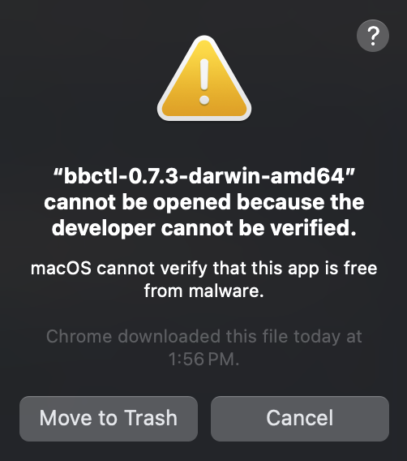
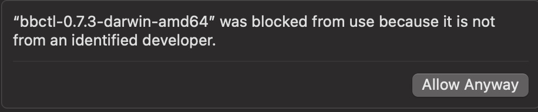
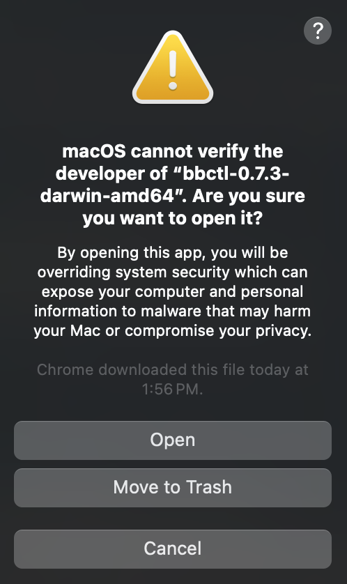

# User Guide

The `bbctl` command line interface (CLI) tool is designed to simplify development, deployment, auditing and troubleshooting of the Big Bang product in a kubernetes cluster. The `bbctl` repository is mirrored to PartyBus <https://code.il2.dso.mil> where a Mission DevOps pipeline is ran and a package is built and pushed back to <https://repo1.dso.mil>. The code has passed security scans and is eligible to receive a certificate to field(CTF).

## Installation

1. Navigate to the [Package Registry Page](https://repo1.dso.mil/big-bang/product/packages/bbctl/-/packages).
1. Locate the most current package based on semantic versioning. Click on the package name.
1. Download the package by clicking on the ```bbctl-x.x.x.tar.gz``` archive.
1. Extract the archive

    ```bash
    tar xvzf ~/Downloads/bbctl-.x.x.x.tar.gz
    ```

1. There are binaries built for Linux and Mac. Based on your operating system move the appropriate binary to a directory that is included in your workstation path. Typically `/usr/local/bin/`
    1. Linux

        ```bash
        # move the downloaded binary
        sudo mv ~/Downloads/bbctl-linux-amd64 /usr/local/bin/
        # create symbolic link
        sudo ln -s /usr/local/bin/bbctl-linux-amd64 /usr/local/bin/bbctl
        # test the version
        bbctl version --client
        ```

    1. Mac

        ```bash
        # move the downloaded binary
        sudo mv ~/Downloads/bbctl-.x.x.x-darwin-amd64 /usr/local/bin/
        # create symbolic link
        sudo ln -s /usr/local/bin/bbctl-.x.x.x-darwin-amd64 /usr/local/bin/bbctl
        # test the version
        bbctl version --client
        ```

*Note: On Mac, you may have to allow the application. See the section for [allowing the binary on Mac](#allowing-the-binary-on-mac) below*

## Usage

The bbctl tool is self documenting so only a few simple examples are included here. The `bbctl` commands work similar to other well known tools such as `kubectl`.

```bash
# show all available commands
bbctl -h

# get the bbctl client version
bbctl version --client

# preflight check: Checks status of k8s cluster before deploying Big Bang
bbctl preflight-check --registryserver https://registry1.dso.mil --registryusername your.name --registrypassword yourPassword

# git status of Big Bang deployment
bbctl status

# get the helm chart values for a helm release as deployed by Big Bang
bbctl values RELEASE_NAME
```

To see a full list of commands, run `bbctl -h`. To see specific command help, usage, and examples, run `bbctl COMMAND -h`.

## Command completion

To enable command completion using the tab key, ensure that `bbctl` completion script gets sourced in all your shell sessions. Execute the following command for details on how to generate the completion script and load it in the supported shells:

```shell
bbctl completion -h
```

## Configuration Files

NOTE: If you are using this, you should be encrypting your home directory at a minimum

You can define a configuration file named `config` in any of the directories listed below. This file should be valid YAML, will only contain root level key-value-pairs, and will be read to provide environment variables.

1. `.`
1. `./.bbctl`
1. `~/.bbctl`
1. `$XDG_CONFIG_HOME/bbctl` (defaults to `~/.config` if `$XDG_CONFIG_HOME` is not set))
1. `/etc/bbctl`

The above paths are utilized in the order they are listed to allow the active configuration to change based on your current working directory.

Example `config` file:

```yaml
"big-bang-repo": "/home/johndoe/src/big-bang/bigbang"
"other-var": "other value"
```

### Encrypting Home Directory

- [Ubuntu](https://askubuntu.com/questions/1335006/what-is-the-recommended-method-to-encrypt-the-home-directory-in-ubuntu-21-04) - also just on os install /home/{{username}}/
- [Red Hat](https://access.redhat.com/documentation/en-us/red_hat_enterprise_linux/9/html/security_hardening/encrypting-block-devices-using-luks_security-hardening) /home/{{username}}/
- [MacOS](https://support.apple.com/guide/mac-help/protect-your-mac-information-with-encryption-mh40593/mac#:~:text=In%20the%20Finder%20on%20your,password%20in%20a%20safe%20place.) /home/{{username}}/
- [Windows](https://support.microsoft.com/en-us/windows/how-to-encrypt-a-file-1131805c-47b8-2e3e-a705-807e13c10da7) - also disk level with tpm in settings if you have pro or better C:\Users\{{username}}\

### Credential Helpers

`bbctl` will often need credentials for various connections. It will attempt to pull appropriate credentials from the sources that control those resources, e.g. `~/.kube/config` or `~/.aws/config`. For other credentials `bbctl` will attempt to use Credential Helpers. Right now there are 2 kinds of credential helpers, shell commands and a credentials file.

#### Shell Command Credential Helper

You can define a shell command to provide credentials to `bbctl`. You will need to set `big-bang-credential-helper` to the command. The command needs to accept 2 positional parameters: `component` and `uri`. The component values will be `username` or `password`. It should return the value for the component given that URI.

Example variable values if you want to set them in the configuration file:

```yaml
"big-bang-credential-helper": "/home/johndoe/custom-credential-helper.sh"
```

Example (unsafe) custom credential helper:

```bash
#! /usr/bin/env bash

if [[ "$1" == "registry1.dso.mil" ]]; then
        if [[ "$2" == "username" ]]; then
                echo -n "John_Doe"
        elif [[ "$2" == "password" ]]; then
                echo -n "a very secure password"
        fi
fi

```

#### Credentials File Credential Helper

You can define a credentials file to provide credentials to `bbctl`. By default it is named `credentials.yaml` and should exist in `~/.bbctl/`. If you want to use the credentials file, you will need to set `big-bang-credential-helper` to `credentials-file`. If you would like to set a different path for the credentials file, you will need to set `big-bang-credential-helper-credentials-file-path` to the full path.

Example variable values if you want to set them in the configuration file:

```yaml
"big-bang-credential-helper": "credentials-file"
"big-bang-credential-helper-credentials-file-path": "/home/johndoe/customFilePath.yaml"
```

The credentials file itself should be valid YAML, contain a key named `credentials` that is an array of maps that each have 3 properties: `username`, `password`, and `uri`.

Example credentials file:

```yaml
credentials:
  - uri: "registry1.dso.mil"
    username: "John_Doe"
    password: "a very secure password"
  - uri: "repo1.dso.mil"
    username: "johndoe"
    password: "a very secure password"
```

## Allowing the Binary on Mac

The MacOS Security default settings usually do not allow unsigned applications to run. You will get a popup (shown below).



Click `Cancel`, then under `System Settings -> Privacy & Security -> Security` you will see a small message (shown below).



Click `Allow Anyway`, then attempt to run the software again. You'll get one last popup, but it will have the option to `Open`, which will allow the software to run.


